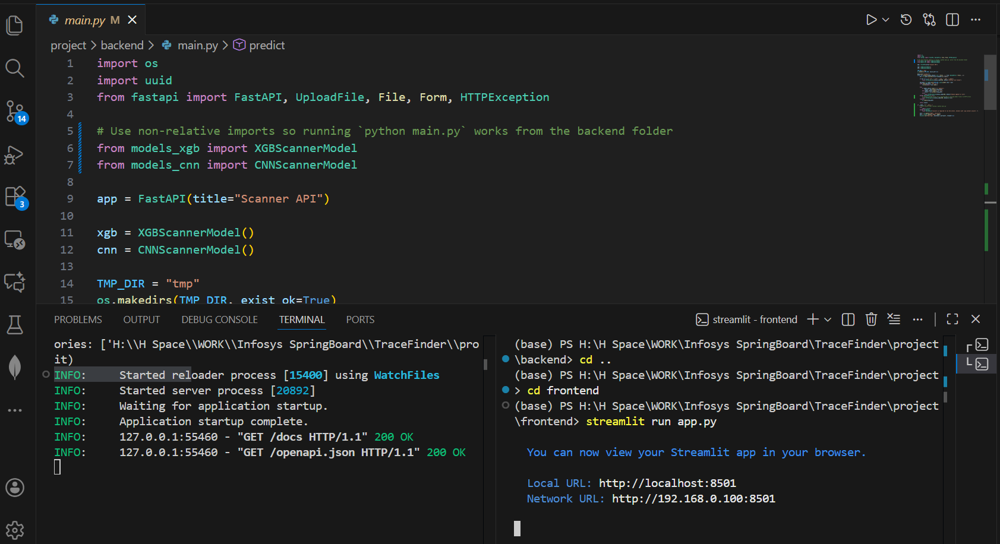
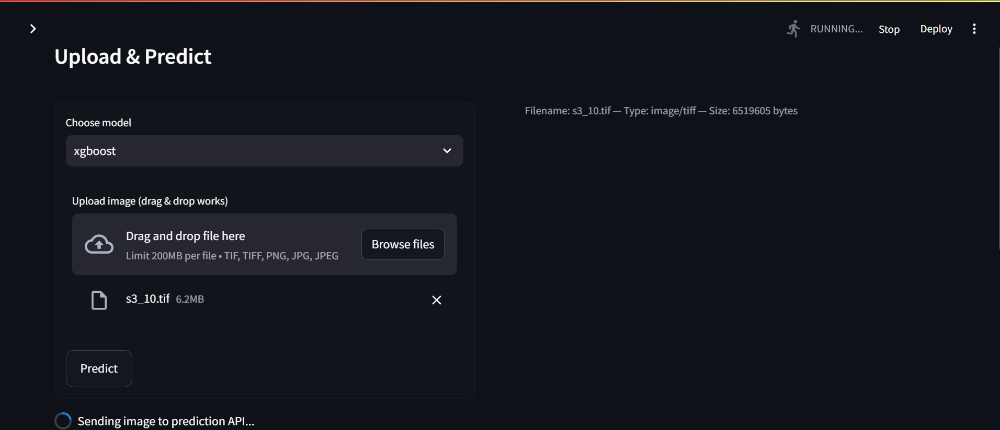

# TraceFinder — Forensic Scanner Identification

TraceFinder is a small forensic tool and demo that identifies the source scanner (brand/model characteristics) from scanned images by learning scanner-specific artifacts and noise signatures.

This repository contains a working backend API (FastAPI) that serves two model types and a Streamlit frontend to upload images and view predictions.

**Key goals:** detect scanner-specific traces, compare classical (XGBoost) and deep (CNN) approaches, and provide a simple demo UI.

---

## 2. Use Cases

### **1. Digital Forensics**
- **Description:** Determine which scanner was used to forge or duplicate legal documents.  
- **Example:** Detect whether a fake certificate was created using a specific scanner model.

### **2. Document Authentication**
- **Description:** Identify the source of printed and scanned images to detect tampering or fraudulent claims.  
- **Example:** Differentiate between scans from authorized and unauthorized departments.

### **3. Legal Evidence Verification**
- **Description:** Ensure scanned copies submitted in court/legal matters came from known and approved devices.  
- **Example:** Verify that scanned agreements originated from the company’s official scanner.

---

## 3. Expected Outcomes
By the end of this project, students will:
- Understand the concept of **source device identification**.  
- Extract **scanner-specific features** such as noise patterns, frequency domain signals, and artifacts.  
- Train a **classification model** to distinguish among multiple scanners.  
- Evaluate **model accuracy** and visualize **feature importance**.  
- Optionally **deploy a simple app** to upload and identify the scanner source.

---

## 4. Dataset
- **Source:** Kaggle  : [Dataset Link](https://www.kaggle.com/datasets/revsyko/tracer)

---

## 5. System Architecture


---

## 6. Modules to Be Implemented

### **1. Data Collection & Labeling**
- Manually scan sample images using multiple scanners.  
- Assign proper labels based on source device.

### **2. Image Preprocessing**
- Resize, denoise, and convert to grayscale if needed.  
- Normalize pixels and remove non-artifact content.

### **3. Feature Extraction**
- Extract noise patterns using filters (e.g., Wavelet, FFT).  
- Compute **PRNU**, texture descriptors, and edge patterns.

### **4. Model Training**
- Train classifiers such as:
  - **CNN** (if using deep features)
  - **Random Forest**, **SVM** (if using extracted features)  
- Evaluate performance on validation set.

### **5. Output System**
- Upload an image → Return probable scanner model.  
- Optional: Display **confidence score** and **feature map**.

---

## 7. Week-wise Implementation Roadmap

---

**Repository layout** (important files)

- `project/` — main project folder
  - `backend/` — API + models + preprocessing
    - `config.py` — model paths and image size
    - `main.py` — FastAPI app exposing `/predict`
    - `models_cnn.py` — wraps the Keras CNN model
    - `models_xgb.py` — wraps the pickled XGBoost model
    - `preprocessing_cnn.py` — CNN input preprocessing pipeline
    - `preprocessing_xgb.py` — feature extraction for XGBoost
  - `frontend/` — Streamlit demo app (`app.py`)
  - `requirements.txt` — Python dependencies for backend/frontend
- `models/` — (not checked into repo) expected trained model files referenced by `backend/config.py`

---

**Implementation details**

- Backend: FastAPI (`project/backend/main.py`). It exposes `POST /predict` which accepts an image and a `model_choice` form value (`xgboost` or `cnn`). The API writes the uploaded file to `tmp/`, runs the selected model class (`XGBScannerModel` or `CNNScannerModel`) and returns JSON with labels, probabilities and confidence scores.

- Models:
  - CNN: Keras model loaded from `project/models/cnn_final_model.keras`. Predictions are returned as a single label + probability distribution. Preprocessing applies wavelet denoising and returns a single-channel normalized input of size defined by `IMG_SIZE` in `config.py`.
  - XGBoost: scikit-learn/pickled model loaded from `project/models/xgb_model.pkl`. The pipeline extracts hand-crafted features (file size, intensity statistics, skew/kurtosis, entropy, edge density) and predicts for two density presets (150 DPI and 300 DPI). Returned JSON contains both `150dpi` and `300dpi` results.

---

Installation

1. Create a virtual environment and activate it (recommended):

```bash
python3 -m venv .venv
source .venv/bin/activate
```

2. Install dependencies:

```bash
pip install -r project/requirements.txt
```

3. Ensure trained model files exist under `project/models/` as referenced in `project/backend/config.py`:

- `cnn_final_model.keras`
- `cnn_label_encoder.pkl`
- `xgb_model.pkl`
- `label_encoder_scikit.pkl`

If you don't have pre-trained models, see the Training section below.

---

Quickstart — run the demo

1. Start the backend API (from repository root):

```bash
uvicorn project.backend.main:app --host 0.0.0.0 --port 8000 --reload
```

2. Start the Streamlit frontend (in a separate terminal):

```bash
streamlit run project/frontend/app.py
```

3. Open the Streamlit UI (usually opened automatically) or go to `http://localhost:8501` and upload an image. Select `xgboost` or `cnn` and press Predict.

You can also call the API directly with `curl`:

```bash
curl -F "model_choice=cnn" -F "file=@/path/to/scan.jpg" http://localhost:8000/predict
```

---

Training (high level)

- CNN: prepare a labeled dataset of scanned images per scanner model, preprocess using `preprocessing_cnn.py` logic (wavelet denoise, normalize, crop/resize to `IMG_SIZE`) and train a Keras model. Save the model and a label encoder into `project/models/`.
- XGBoost: extract features using `preprocessing_xgb.py` and train an XGBoost classifier (or scikit-learn wrapper). Save the pickled model and label encoder into `project/models/`.

Because training code and datasets are not included, training scripts should follow the preprocessing conventions in `project/backend/` to ensure compatibility.

---
Implementation Images
       
---

Notes & Troubleshooting

- The backend expects common raster formats: `.tif`, `.tiff`, `.png`, `.jpg`, `.jpeg`.
- If `uvicorn` fails to load models, verify the model files are present and paths in `project/backend/config.py` are correct.
- For production use, secure the API and run the server behind a proper web server (Gunicorn, containers) and add input size limits and authentication.


---